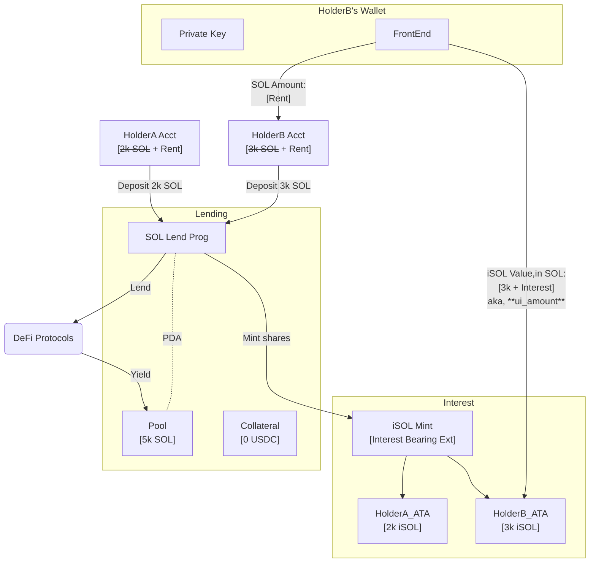
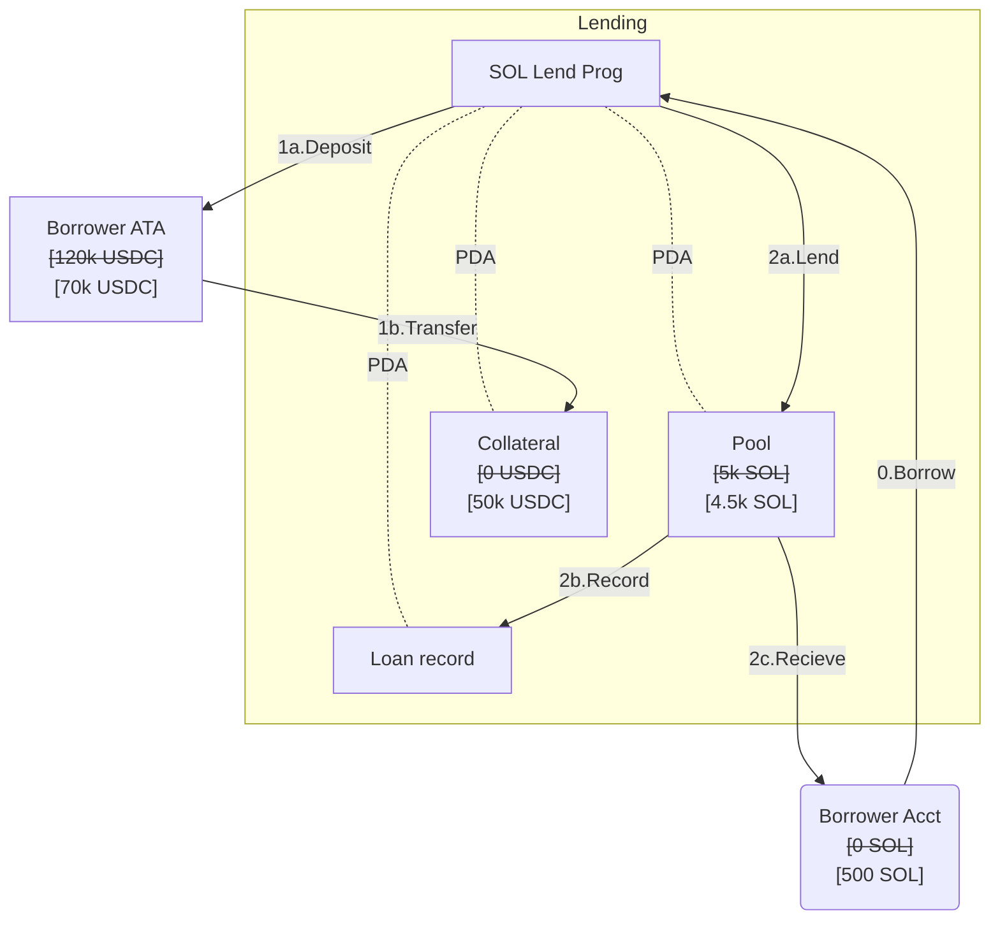
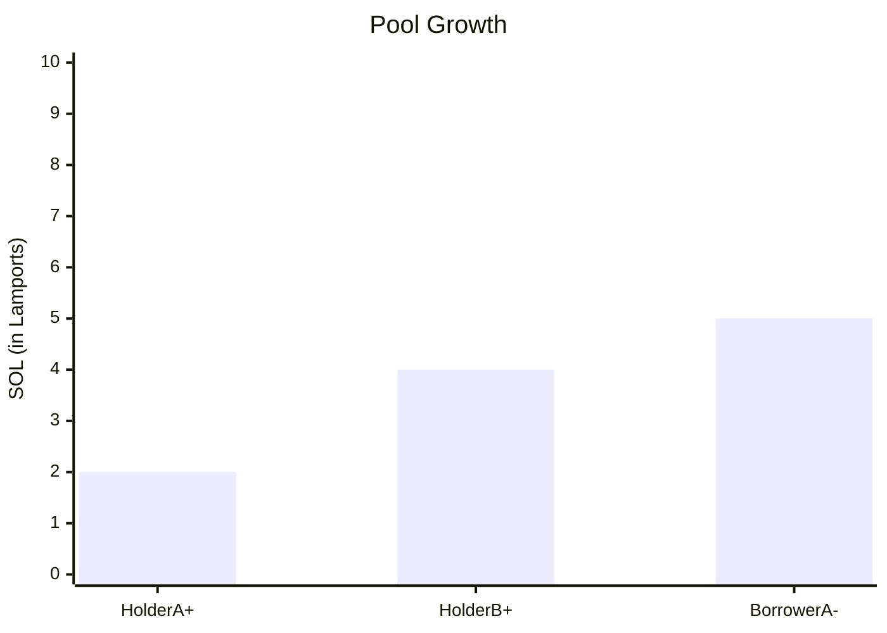

> :warning: Not meant to be used in production.  
> :warning: Math is WIP. **Use only as an architectural example.**

# What is this?
This is a reference implementation of a Solana lending pool program, using the Interest Bearing token extension to represent shares of the pool, and built with Anchor. 
This implementation illustrates how on-chain protocols influence [client-side implementations](https://solana.com/developers/guides/token-extensions/interest-bearing-tokens).  

# How to run
1. Clone the repository
2. Run `anchor build`
3. Run `anchor test`

# What does this reference implementation do?
See the tests in [lending-pool.ts](tests/lending-pool.ts) for implementation details. At a high level, it does the following:
- Creates a lending pool from SOL deposits in exchange for iSOL interest-bearing shares.
- Allows users to borrow SOL with USDC collateral.
- Immediately accrues interest on the pool upon borrowing.

## Illustrated example
### Lending flow

### Lending pool states

- No borrowers present.
- Interest rate is 0%.
    - Holders are not accumulating wealth.
- Interest rate == utilization rate (Borrowed / Deposits)  
  

- A single borrower effectively borrows `50%` of the pool.
    - Each holder’s contribution (marked by color shade) is uniformly reserved for the loan.
- Utilization rate is 50% = Interest rate is 50%.
    - Interest rate gets adjusted automatically upon issuing loans.
- Interest rate is based on 1 year __fixed rate.__
    - EOY projected repayment amount is committed upon borrowing (150% of borrowed amount).
    - Paying off early has no effect on interest rate.
- Borrower will settle with 150% of borrowed amount 
    - 2 SOL loaned + 1 SOL interest = 3 SOL.
- Holders being accumulating interest upon borrowing.

# Features not yet implemented
- [ ] Withdrawing SOL  

# Features out of scope
- Liquidation mechanism.
